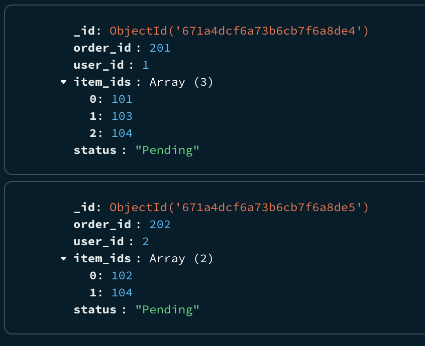

# MongoDB - Kafka - Neo4j


## Description
This sample project demonstrates how an insert operation in MongoDB can be captured via Change Stream listened to by a Kafka Connect Worker which acts as a producer to a Kafka topic. Another Kafka Connect Worker listens to the Kafka topic acting as a consumer and writes the data to Neo4j. 

Such a setup can be used where the primary database is MongoDB and for recommendation systems, graph databases like Neo4j are used.

Setup on local using docker-compose
```bash
docker compose up -d
```


Note: The volume mapping is commented in the `docker-compose.yml` file. Uncomment it if you want to persist the data.

## Data Flow
1. First `initial_data_load.py` script adds some initial data such as the users and the items to MongoDB.

2. For Kafka Connect Worker as a MongoDB Source Connector, download the self hosted version, extract it and place the folder in `kafka-connect-jars` folder. https://www.confluent.io/hub/mongodb/kafka-connect-mongodb

3. Publish the `mongodb_source_connector.json` configuration to Kafka Connect.
    ```bash
    curl -X POST -H "Content-Type: application/json" --data @mongodb_source_connector.json http://localhost:8083/connectors
    ```

4. Execute `create_orders.py` to create two orders in MongoDB. This will trigger the Change Stream and the data will be published to Kafka.

#### Data in MongoDB


#### Data in Kafka


5. For Kafka Connect Worker as a Neo4j Sink Connector, download the self hosted version, extract it and place the folder in `kafka-connect-jars` folder. https://www.confluent.io/hub/neo4j/kafka-connect-neo4j

6. Publish the `neo4j_sink_connector.json` configuration to Kafka Connect.
    ```bash
    curl -X POST -H "Content-Type: application/json" --data @neo4j_sink_connector.json http://localhost:8083/connectors
    ```

7. Doing so, the kafka connect worker will consume the data from the Kafka topic and write it to Neo4j

### Data in Neo4j
 

